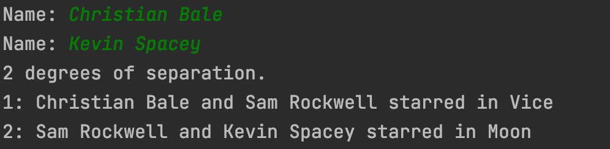

# degrees
Forked from HarvardX CS50 AI's course. Implemented the *shortest_path* method using a Breadth First Search (BFS) algorithm

degrees.py finds the shortest set of actors who connect two actors. 

[Project Details](https://cs50.harvard.edu/ai/2020/projects/0/degrees/)
